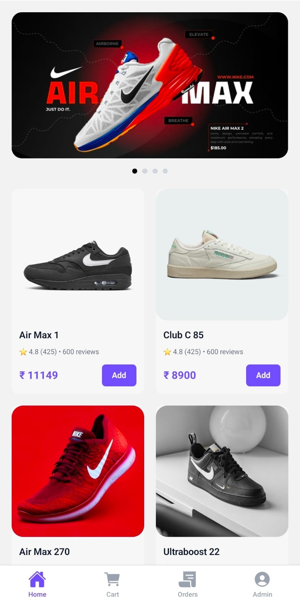
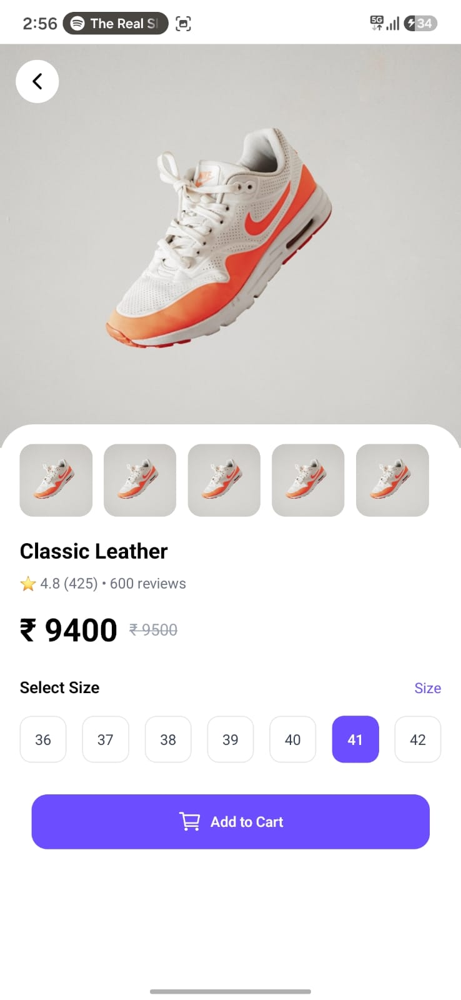
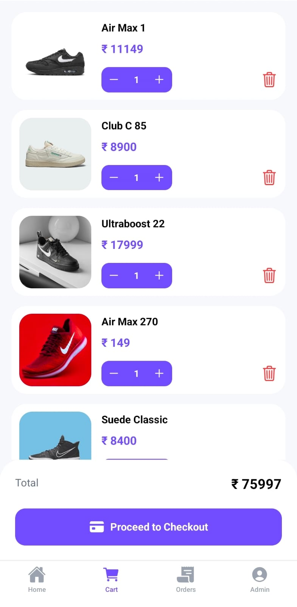
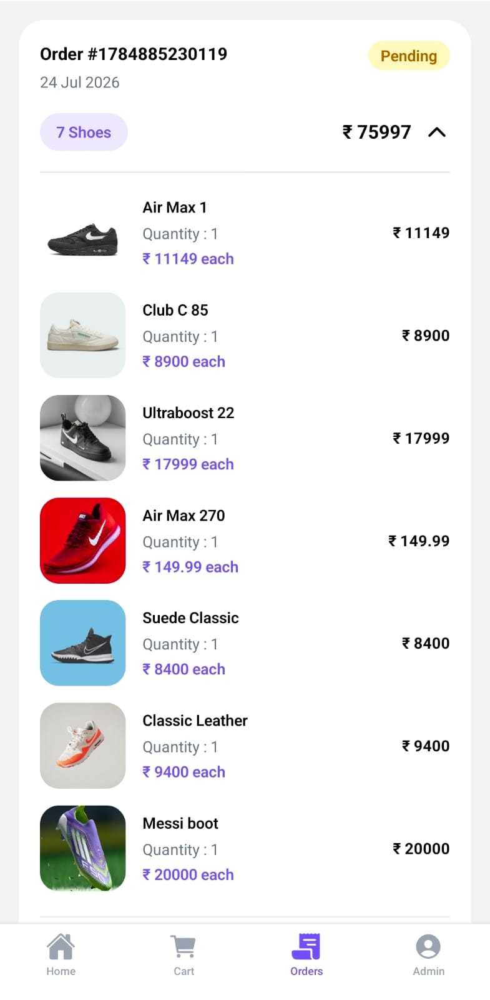
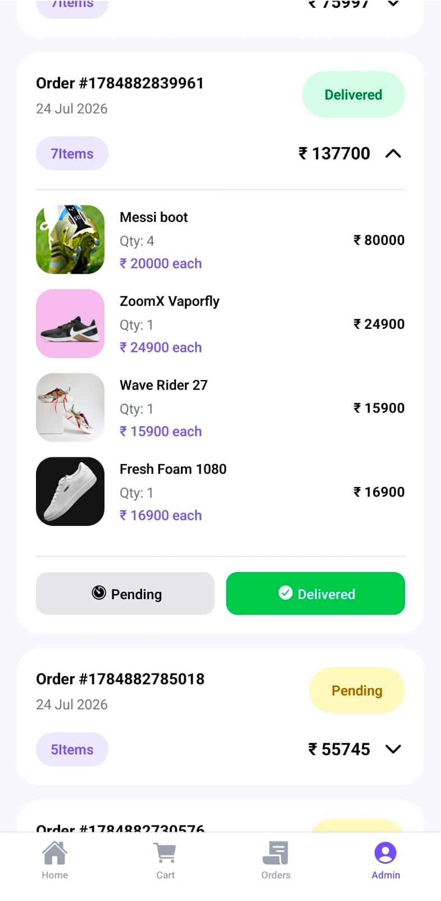
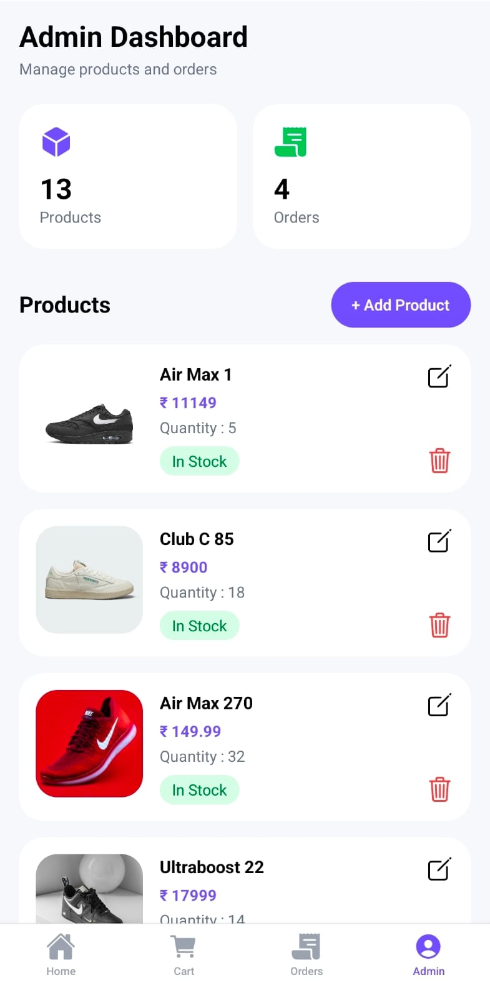
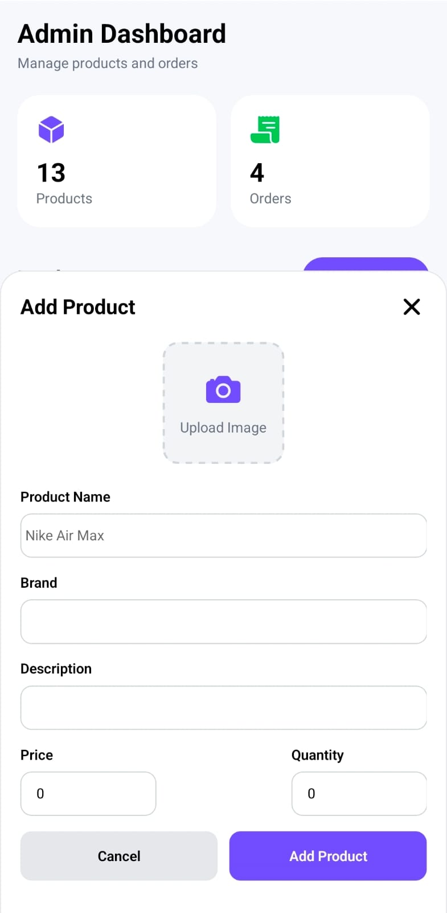
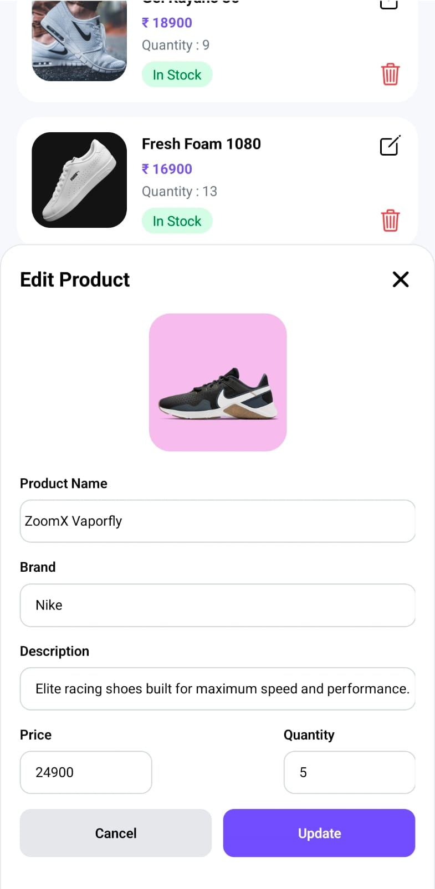

# 👟 Shoe Store App

A modern **React Native Shoe Store** application built with **Expo**, **TypeScript**, **Redux Toolkit**, and **Expo Router**.

The app demonstrates a complete e-commerce flow including product browsing, shopping cart, checkout, order management, and an admin panel for inventory management.

---

# 📱 Features

## 👤 User Features

- Browse all available shoes
- View product details
- Select shoe size
- Add shoes to cart
- Increase / Decrease quantity
- Remove items from cart
- Stock validation
- Checkout (without payment gateway)
- View order history
- Expandable order details
- Persistent cart & orders

---

## 🛠 Admin Features

- Add new shoes
- Edit existing shoes
- Delete shoes
- Upload shoe image
- Manage stock quantity ( Low Stock )
- View all customer orders
- Update order status
  - Pending
  - Delivered

---

# 🏗 Tech Stack

- React Native
- Expo
- TypeScript
- Expo Router
- Redux Toolkit
- Redux Persist
- AsyncStorage
- NativeWind
- Expo Image
- Expo Image Picker
- React Native Reanimated Carousel
- React Native Flash Message ( Toast Messages )
- Tamagui (Card + Buttons )
- Zod ( Form Validation ) Path => src/componets/admin/schema/schema.ts

---

# 📦 Packages Used

| Package                                   | Purpose                | Documentation                                               |
| ----------------------------------------- | ---------------------- | ----------------------------------------------------------- |
| expo                                      | React Native Framework | https://docs.expo.dev                                       |
| react-native                              | Mobile Framework       | https://reactnative.dev                                     |
| typescript                                | Type Safety            | https://www.typescriptlang.org                              |
| expo-router                               | Navigation             | https://docs.expo.dev/router/introduction                   |
| @reduxjs/toolkit                          | State Management       | https://redux-toolkit.js.org                                |
| react-redux                               | Redux Binding          | https://react-redux.js.org                                  |
| redux-persist                             | Persist Redux State    | https://github.com/rt2zz/redux-persist                      |
| @react-native-async-storage/async-storage | Local Storage          | https://react-native-async-storage.github.io/async-storage  |
| nativewind                                | Tailwind CSS           | https://www.nativewind.dev                                  |
| tailwindcss                               | Styling                | https://tailwindcss.com                                     |
| expo-image                                | Image Rendering        | https://docs.expo.dev/versions/latest/sdk/image             |
| expo-image-picker                         | Image Upload           | https://docs.expo.dev/versions/latest/sdk/imagepicker       |
| react-native-reanimated-carousel          | Carousel               | https://github.com/dohooo/react-native-reanimated-carousel  |
| react-native-flash-message                | Toast Messages         | https://github.com/lucasferreira/react-native-flash-message |
| @expo/vector-icons                        | Icons                  | https://icons.expo.fyi                                      |
| tamagui                                   | UI Components          | https://tamagui.dev                                         |

---

# 📂 Project Structure

```
app
 ├── (tabs)
 │    ├── home.tsx
 │    ├── cart.tsx
 │    ├── orders.tsx
 │    └── admin.tsx
 │
 ├── shoe
 │    └── [id].tsx
 │
 └── _layout.tsx

src
├── assets/                     # Images, icons and static assets
│
├── components/                 # Reusable UI components
│   ├── CommonSelect.tsx
│   ├── ConfirmDialog.tsx
│   └── ShoeCard.tsx
│
├── admin/                      # Admin-specific modules
│   ├── modals/
│   │   └── AddOrEditProductModal.tsx
│   │
│   └── schema/
│       └── schema.ts          # Zod validation schema
│
├── constants/                  # App constants
│
├── hooks/                      # Custom React hooks
│
│
├── store/                      # Redux Toolkit
│   ├── cartSlice.ts
│   ├── orderSlice.ts
│   ├── shoeSlice.ts
│   └── index.ts
│
├── types/                      # TypeScript interfaces & types
│
└── utils/                      # Utility/helper functions
```

---

# 📹 Vedio Demo

https://ik.imagekit.io/pushkar10/WhatsApp%20Video%202026-07-24%20at%203.19.18%20PM.mp4

# 📷 Screenshots

## Home



---

## Product Details



---

## Cart



---

## Orders



---

## Admin




---

## Add / Edit Product





---

# 🚀 Getting Started

Clone the repository

```bash
git clone https://github.com/Pushkar155/React_Native_NavTech.git
```

Install dependencies

```bash
npm install
```

Run the application

```bash
npx expo start
```

Run Android

```bash
npx expo run:android
```

Run iOS

```bash
npx expo run:ios
```

---

# 💾 State Management

The application uses **Redux Toolkit** with **Redux Persist**.

Persisted data:

- Cart
- Orders

Storage:

- AsyncStorage

---

# ✨ Future Improvements

- Authentication
- Wishlist
- Product Search
- Product Filters
- Payment Integration
- Push Notifications ( FCM )
- Backend APIs ( REST )
- Cloud Database
- Dark Mode ( Toggle )
- Order Tracking

---

# 👨‍💻 Author

**Pushkar Chaubey**

GitHub:
https://github.com/Pushkar155

LinkedIn:
https://www.linkedin.com/in/pushkar-chaubey-145311202/

Website:
https://pushkarchaubey.in/

---

# 📄 License

This project was created as part of a React Native technical assessment.
